# VisionFilters

## Parte I - Filtros convolucionais

### 1. Introducao da Parte I

Nesta parte do trabalho eu implementei filtros convolucionais no dominio espacial. A ideia principal foi aplicar pequenos kernels sobre a vizinhanca de cada pixel e observar como a escolha dos pesos muda a imagem. Usei a convolucao manual implementada em `src/convolution.py`, sem usar funcoes prontas como `cv2.filter2D`, `scipy.signal.convolve2d` ou `ndimage.convolve`.

As figuras foram geradas em quatro grupos:

- `outputs/parte1_filtros/`: resultado visual principal de cada filtro.
- `outputs/parte1_padding/`: comparacao dos paddings.
- `outputs/parte1_frequencias/`: analise visual no dominio das frequencias.
- `outputs/parte1_pipelines/`: exemplos de uso no dia a dia.

Na analise em frequencia eu usei `np.fft` apenas para visualizar espectros e respostas dos kernels na Parte I. A implementacao dos filtros continuou sendo feita por convolucao manual. A Parte II fica separada em `src/fourier_manual.py`, onde a DFT e a IDFT deverao ser manuais.

### 2. Como a convolucao foi implementada

A convolucao foi implementada com tres funcoes principais:

- `pad_image(img, pad_h, pad_w, mode)`: cria a borda artificial quando o filtro precisa consultar pixels fora da imagem.
- `conv_op(i, j, img, kernel)`: calcula um pixel filtrado, multiplicando a vizinhanca pelo kernel e somando os produtos.
- `convolve2d(img, kernel, padding)`: percorre todos os pixels com lacos `for`, inverte o kernel e aplica `conv_op`.

O detalhe mais importante e que o kernel e invertido com `np.flip(kernel)` antes de aplicar. Sem essa inversao, a operacao seria correlacao, nao convolucao. Para kernels simetricos, como media e Gaussiano, a diferenca visual praticamente nao aparece. Para kernels direcionais, como Sobel, shift e emboss, a inversao importa porque a direcao dos pesos muda o resultado.

Em cada pixel, o kernel fica centralizado no ponto sendo calculado. Por exemplo, num kernel `3x3`, o pixel central da vizinhanca fica alinhado com o centro do kernel. A nova intensidade e a soma ponderada dessa vizinhanca.

### 3. Como o padding foi implementado

O padding resolve o problema das bordas. Quando o kernel esta perto do limite da imagem, parte da vizinhanca estaria fora da matriz original. Foram comparados cinco modos:

- `none`: nao cria padding. So os pixels cuja vizinhanca inteira existe sao calculados; as bordas ficam zeradas no resultado.
- `zero`: completa fora da imagem com valor 0, criando bordas pretas artificiais.
- `edge`: repete o pixel mais proximo da borda.
- `reflect`: espelha a imagem na borda.
- `wrap`: conecta lados opostos, como se a imagem fosse periodica.

As figuras abaixo mostram os efeitos na imagem inteira e num crop de canto. O crop deixa mais claro que o padding nao afeta a imagem toda igualmente: ele aparece principalmente perto das bordas.

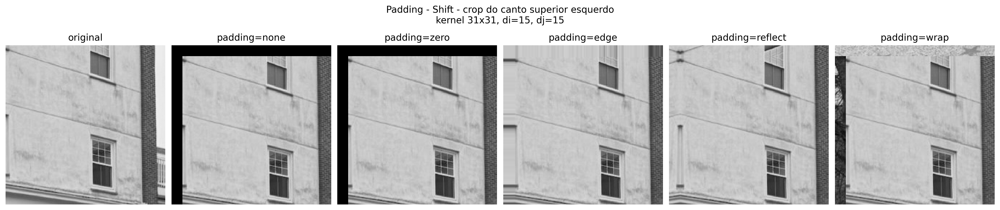

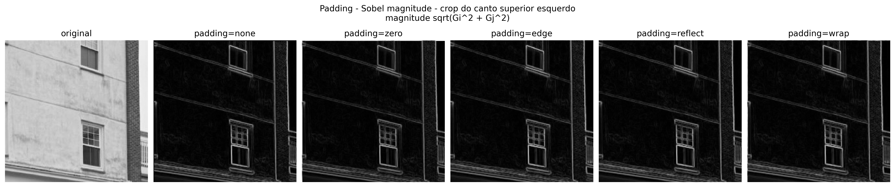

Visualmente, o `zero` cria faixas pretas ou bordas artificiais. O `edge` evita preto, mas pode esticar linhas e tons. O `reflect` normalmente e o mais natural para fotos, porque preserva continuidade local. O `wrap` so faz sentido quando a imagem e periodica; em fotografias comuns ele mistura lados que nao tem relacao.

Para os resultados finais dos filtros, eu usaria `reflect`, porque ele gera menos artefato visual em fotografias naturais e evita criar uma borda preta que nao existe na cena.

### 4. Shift

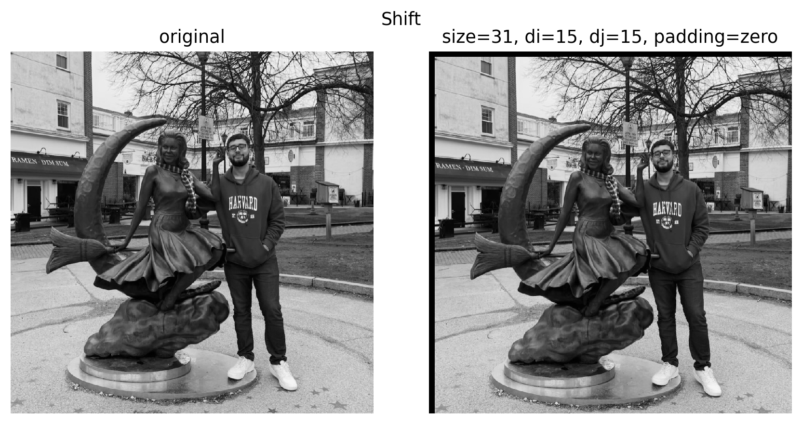

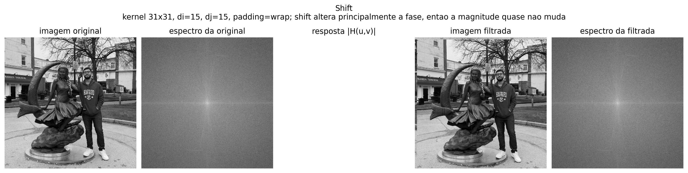


**Qual e o proposito deste filtro?**  
O shift desloca a imagem. O kernel tem apenas um coeficiente igual a 1 fora do centro e zeros no resto. Isso faz cada pixel copiar um vizinho deslocado.

**Comparacao com filtros semelhantes.**  
Diferente da media, do Gaussiano, do Sobel ou do Laplace, o shift nao suaviza nem detecta bordas. Ele apenas muda a posicao espacial dos valores. E um filtro bom para entender que a posicao dos coeficientes no kernel importa.

**Impacto dos diferentes paddings.**  
O padding fica muito evidente no shift, porque o deslocamento expoe diretamente a borda que foi criada. Com `zero`, aparece uma faixa preta. Com `edge`, a borda parece esticada. Com `reflect`, a borda fica espelhada. Com `wrap`, pixels do lado oposto aparecem na borda.

**Qual padding eu usaria e por que?**  
Para demonstrar o efeito, `zero` e bom porque a faixa preta deixa o deslocamento claro. Para resultado final em foto, eu usaria `reflect`, pois ele evita a faixa preta e mantem uma transicao mais natural.

**Comportamento em frequencias.**  
O shift preserva a magnitude do espectro e altera principalmente a fase. Isso aparece na figura de frequencias: o espectro da imagem original e da imagem deslocada fica muito parecido em magnitude.

**Quais frequencias ele suprime ou realca?**  
Idealmente, nenhuma frequencia e suprimida ou realcada em magnitude. O conteudo de frequencias continua o mesmo; o que muda e a fase.

**Aparece no dia a dia?**  
Sim. Deslocamentos aparecem em alinhamento de imagens, estabilizacao de video, registro de imagens medicas, panoramas e pequenas correcoes de posicao em editores de imagem.

### 5. Caixa/Media

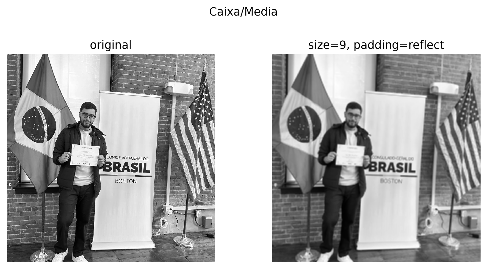


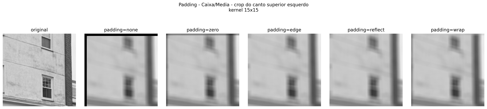

**Qual e o proposito deste filtro?**  
O filtro de caixa ou media suaviza a imagem. Cada pixel novo vira a media dos pixels da vizinhanca. Isso reduz ruido e pequenas variacoes, mas tambem remove detalhes.

**Comparacao com filtros semelhantes.**  
Comparado ao Gaussiano, a media e mais simples, pois todos os vizinhos recebem o mesmo peso. O Gaussiano pesa mais o centro e menos as bordas, por isso costuma borrar de forma mais natural. Comparado ao unsharp mask, a media faz o contrario: ela remove altas frequencias em vez de realca-las.

**Impacto dos diferentes paddings.**  
Em filtros de suavizacao, o padding afeta bastante as bordas porque a media usa muitos pixels externos quando o kernel e grande. Com `zero`, as bordas escurecem. Com `edge`, a borda fica com tons repetidos. Com `reflect`, a transicao fica mais continua. Com `wrap`, conteudo do lado oposto entra na media e pode gerar mistura estranha.

**Qual padding eu usaria e por que?**  
Eu usaria `reflect`, porque ele evita o escurecimento do `zero` e nao cria uma repeticao tao rigida quanto o `edge`.

**Comportamento em frequencias.**  
A media e um filtro passa-baixa: preserva baixas frequencias, que correspondem a regioes suaves, e reduz altas frequencias, que correspondem a detalhes finos e ruido. Na resposta em frequencia, aparece um formato parecido com uma sinc 2D.

**Quais frequencias ele suprime ou realca?**  
Ele suprime altas frequencias e preserva baixas frequencias. Como a resposta tipo sinc tem lobos, pode gerar oscilacoes/ringing em algumas situacoes, principalmente perto de transicoes fortes.

**Aparece no dia a dia?**  
Sim. E uma ideia basica de reducao de ruido, pre-processamento e suavizacao rapida. Na pratica, filtros mais sofisticados costumam ser preferidos, mas a media e um ponto de partida importante.

### 6. Gaussiano

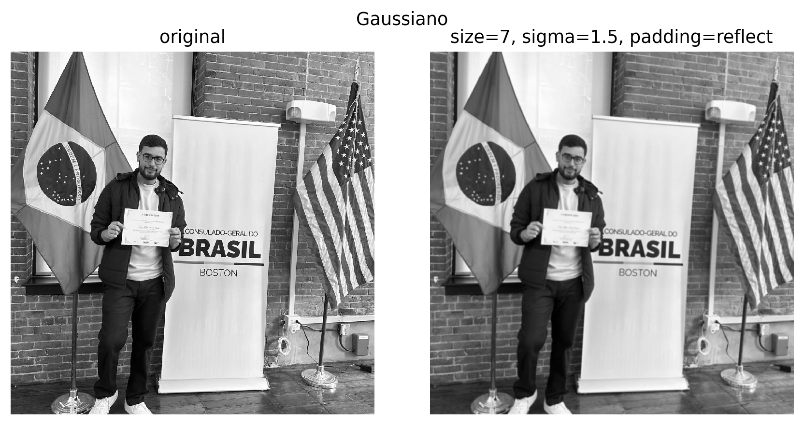

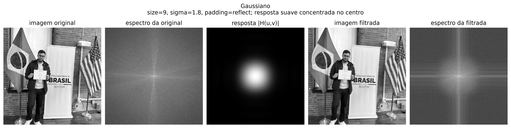


**Qual e o proposito deste filtro?**  
O filtro Gaussiano suaviza a imagem, mas de forma mais controlada que a media. Os pixels perto do centro do kernel recebem pesos maiores e os mais distantes recebem pesos menores.

**Comparacao com filtros semelhantes.**  
Assim como a media, o Gaussiano e passa-baixa. A diferenca e que a resposta do Gaussiano e mais suave e nao tem oscilacoes fortes como o filtro caixa. Por isso ele costuma preservar melhor a aparencia natural da imagem, mesmo borrando detalhes.

**Impacto dos diferentes paddings.**  
O impacto e parecido com o da media, mas geralmente menos brusco porque os pesos mais distantes sao menores. O `zero` ainda escurece bordas, `edge` repete tons, `reflect` cria continuidade e `wrap` mistura lados opostos.

**Qual padding eu usaria e por que?**  
Eu usaria `reflect`, porque o Gaussiano assume uma transicao suave da vizinhanca. Espelhar a borda combina melhor com essa ideia do que preencher com preto.

**Comportamento em frequencias.**  
O Gaussiano e um passa-baixa suave. No dominio das frequencias, a energia fica concentrada no centro, que representa baixas frequencias. Ele reduz altas frequencias sem os lobos fortes da media.

**Quais frequencias ele suprime ou realca?**  
Ele suprime altas frequencias, como ruido e detalhes muito finos. Ele preserva baixas frequencias, como iluminacao geral e formas grandes. Nao e um filtro de realce; ele reduz variacoes rapidas.

**Aparece no dia a dia?**  
Sim. E muito usado em fotografia digital, reducao de ruido, pre-processamento para deteccao de bordas e efeitos de desfoque. Detectores como Canny usam suavizacao antes da etapa de derivada.

### 7. Laplace

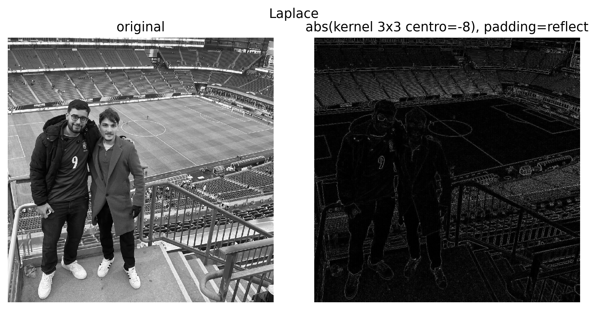

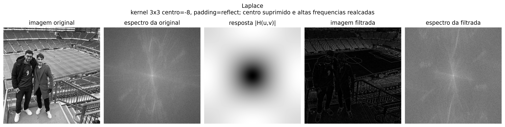

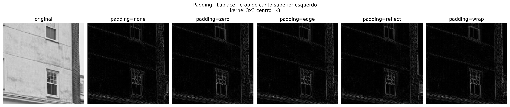

**Qual e o proposito deste filtro?**  
O Laplace detecta mudancas bruscas de intensidade. Ele responde pouco em regioes uniformes e responde forte em bordas, contornos e detalhes.

**Comparacao com filtros semelhantes.**  
Comparado ao Sobel, o Laplace nao separa uma direcao especifica: ele e mais isotropico, ou seja, responde a bordas em varias orientacoes. O Sobel estima o gradiente em direcoes, enquanto o Laplace aproxima uma segunda derivada.

**Impacto dos diferentes paddings.**  
O Laplace e muito sensivel a bordas artificiais. Com `zero`, a transicao entre imagem e preto vira uma borda forte que nao existia. Com `edge` e `reflect`, o artefato diminui. Com `wrap`, podem aparecer bordas falsas quando lados opostos sao muito diferentes.

**Qual padding eu usaria e por que?**  
Eu usaria `reflect`, porque ele reduz a criacao de bordas falsas perto dos limites da imagem.

**Comportamento em frequencias.**  
O Laplace e passa-alta e isotropico. Ele suprime regioes constantes/DC, porque uma area constante tem segunda derivada zero. No espectro, o centro, que representa baixas frequencias, fica suprimido e as altas frequencias sao realcadas.

**Quais frequencias ele suprime ou realca?**  
Ele suprime baixas frequencias e principalmente o componente DC. Ele realca altas frequencias, como bordas, textura fina e ruido.

**Aparece no dia a dia?**  
Sim. Aparece em deteccao de bordas, realce de nitidez, analise de textura e etapas de pre-processamento. Como e sensivel a ruido, muitas vezes e usado depois de uma suavizacao, como no Laplaciano de Gaussiano.

### 8. Sobel

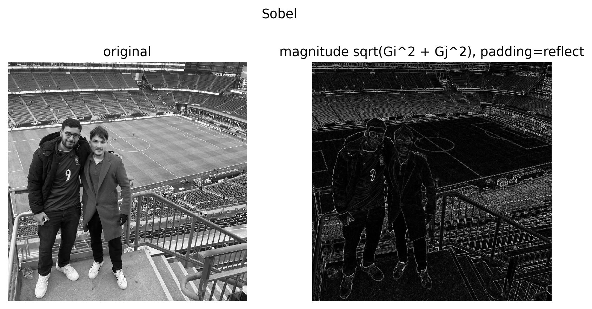

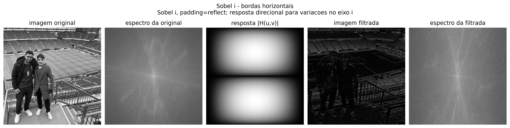

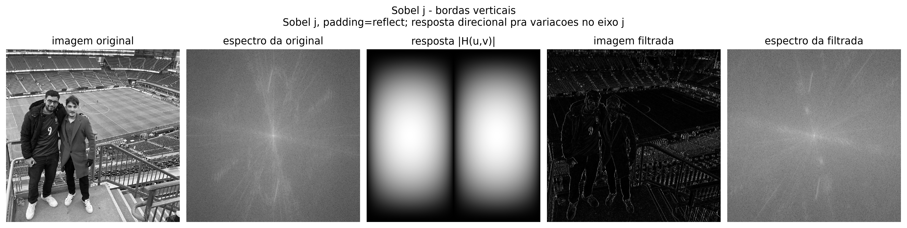

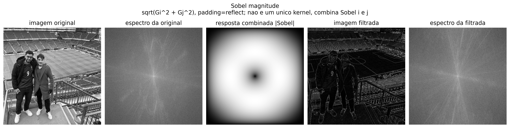


**Qual e o proposito deste filtro?**  
O Sobel detecta bordas estimando o gradiente da imagem. A implementacao calcula duas componentes, uma para variacoes no eixo `i` e outra para variacoes no eixo `j`, e depois combina pela magnitude.

**Comparacao com filtros semelhantes.**  
Comparado ao Laplace, o Sobel e direcional. Ele permite separar bordas horizontais e verticais. Comparado a uma derivada simples, o Sobel tambem faz uma pequena suavizacao na direcao perpendicular, o que ajuda a reduzir um pouco a sensibilidade a ruido.

**Impacto dos diferentes paddings.**  
O Sobel transforma descontinuidades em bordas. Entao o padding aparece bastante: `zero` cria bordas fortes nas laterais, `edge` reduz esse efeito, `reflect` fica mais natural e `wrap` pode criar bordas falsas ao ligar lados opostos.

**Qual padding eu usaria e por que?**  
Eu usaria `reflect`, porque evita uma borda artificial escura e deixa a resposta nas extremidades menos contaminada.

**Comportamento em frequencias.**  
O Sobel e passa-alta direcional. Ele realca mudancas em direcoes especificas e suprime regioes quase constantes. A magnitude combina as duas respostas direcionais para mostrar bordas em varias orientacoes.

**Quais frequencias ele suprime ou realca?**  
Ele suprime baixas frequencias/regioes suaves e realca altas frequencias relacionadas a contornos. Como e uma derivada, tambem pode realcar ruido.

**Aparece no dia a dia?**  
Sim. Aparece em visao computacional, segmentacao, deteccao de contornos, reconhecimento de objetos e analise de documentos. E tambem ajuda a explicar por que pipelines reais costumam suavizar a imagem antes de detectar bordas.

### 9. Aumento de Nitidez com Laplace

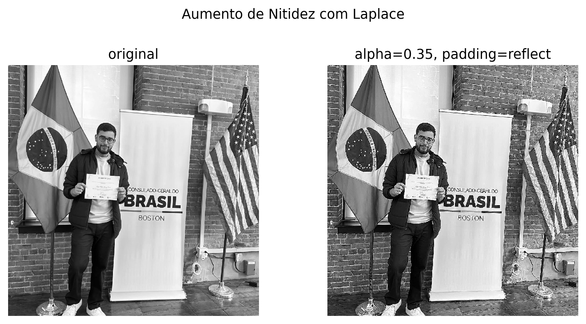

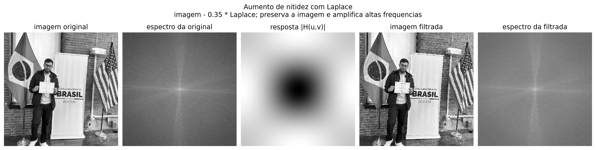

**Qual e o proposito deste processo?**  
O objetivo e deixar a imagem mais nitida. Em vez de mostrar apenas o Laplace, o processo usa a ideia `imagem_nitida = imagem_original - alpha * laplace`. Assim, a imagem base continua presente e as altas frequencias sao amplificadas.

**Comparacao com filtros semelhantes.**  
Comparado ao Laplace puro, a nitidez com Laplace nao gera uma imagem so de bordas. Ela preserva tons, formas e iluminacao da imagem original. Comparada ao unsharp mask, ela pode ser mais agressiva porque usa diretamente uma segunda derivada.

**Impacto dos diferentes paddings.**  
Como o processo depende do Laplace, ele tambem sofre com bordas artificiais. Se usar `zero`, o Laplace pode criar uma borda forte no limite da imagem e isso entra na imagem nitida. Com `reflect`, esse artefato diminui.

**Qual padding eu usaria e por que?**  
Eu usaria `reflect`, porque o objetivo e melhorar a nitidez sem criar halos ou contornos falsos nas bordas.

**Comportamento em frequencias.**  
A nitidez com Laplace preserva a base da imagem e amplifica altas frequencias. Entao ela nao e simplesmente um passa-alta puro: ela mantem baixas frequencias e aumenta detalhes.

**Quais frequencias ele suprime ou realca?**  
Ele preserva baixas frequencias e realca altas frequencias. Se o fator `alpha` for grande, tambem pode realcar ruido e gerar halos.

**Aparece no dia a dia?**  
Sim. Ideias parecidas aparecem em ajustes de nitidez de cameras, scanners, aplicativos de foto e pre-processamento para melhorar legibilidade de texto e contornos.

### 10. Unsharp Mask

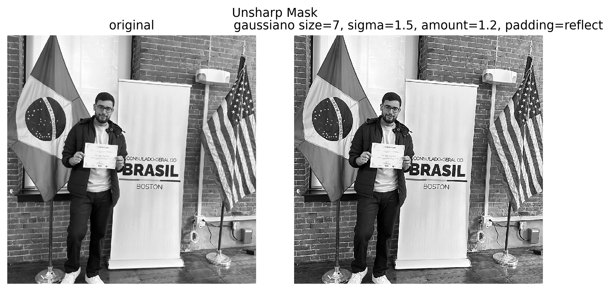

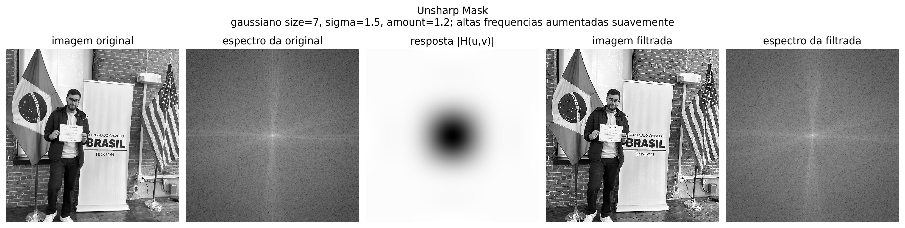

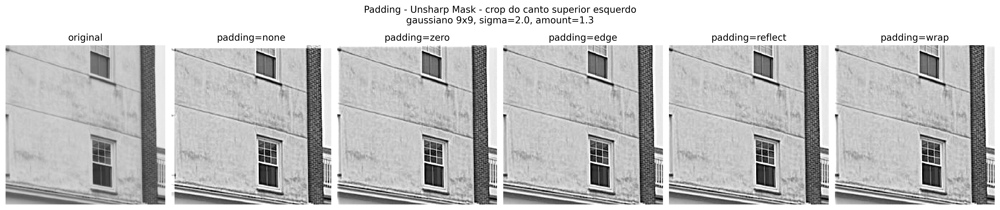

**Qual e o proposito deste processo?**  
O unsharp mask aumenta nitidez subtraindo uma versao borrada da imagem. Primeiro calculamos `borrada = gaussiano(imagem)`. Depois a mascara `imagem - borrada` guarda detalhes. Por fim, somamos essa mascara de volta na imagem.

**Comparacao com filtros semelhantes.**  
Comparado ao aumento de nitidez com Laplace, o unsharp mask costuma ser mais suave e controlavel, porque a mascara vem da diferenca entre a imagem e uma versao suavizada. Comparado ao Gaussiano, ele faz o contrario: usa o blur para descobrir o que deve ser realcado.

**Impacto dos diferentes paddings.**  
O padding entra na etapa do Gaussiano. Se usar `zero`, a imagem borrada perto da borda fica escurecida e a mascara pode criar halo. Com `reflect`, o borramento perto das bordas fica mais natural.

**Qual padding eu usaria e por que?**  
Eu usaria `reflect`, porque e o modo que melhor evita halos artificiais no contorno da imagem.

**Comportamento em frequencias.**  
O unsharp mask preserva baixas frequencias e aumenta altas frequencias de forma mais suave. A parte borrada representa as baixas frequencias; ao subtrair essa versao, a mascara destaca detalhes.

**Quais frequencias ele suprime ou realca?**  
Ele nao remove a estrutura geral da imagem. Ele realca altas frequencias, como bordas e detalhes, e mantem baixas frequencias associadas a iluminacao e formas grandes.

**Aparece no dia a dia?**  
Sim. E um dos processos classicos de nitidez em fotografia digital, editores de imagem, cameras de celular e preparacao de imagens para impressao.

### 11. Emboss como filtro criativo

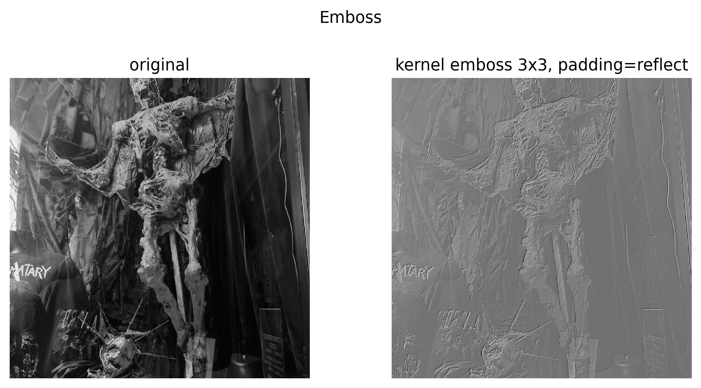

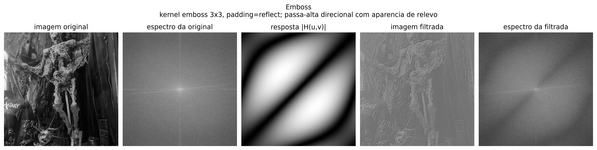

**Qual e o proposito deste filtro?**  
O emboss cria uma aparencia de relevo. O kernel tem pesos negativos de um lado e positivos do outro, simulando uma iluminacao lateral. Regioes uniformes ficam mais neutras e bordas viram destaque.

**Comparacao com filtros semelhantes.**  
Assim como Sobel e Laplace, o emboss realca mudancas de intensidade. A diferenca e que ele nao foi escolhido principalmente para medir bordas, mas para criar um efeito visual direcional. Ele e mais artistico que analitico.

**Impacto dos diferentes paddings.**  
Como e direcional e realca bordas, o padding pode criar relevo falso nos limites da imagem. `zero` tende a criar uma borda artificial; `reflect` reduz esse efeito. O `wrap` pode trazer informacao do lado oposto e criar relevo sem sentido em fotos comuns.

**Qual padding eu usaria e por que?**  
Eu usaria `reflect`, pois o efeito criativo fica mais limpo nas bordas e menos dependente de uma faixa artificial.

**Comportamento em frequencias.**  
O emboss funciona como um passa-alta direcional. Ele destaca variacoes em uma direcao especifica, por isso a resposta em frequencia tambem tem orientacao.

**Quais frequencias ele suprime ou realca?**  
Ele reduz regioes constantes ou lentas e realca altas frequencias direcionais, principalmente bordas alinhadas com a direcao do kernel.

**Aparece no dia a dia?**  
Sim. Aparece em efeitos de edicao de imagem, textura, design grafico, simulacao de relevo e filtros artisticos.

### 12. Pipelines do dia a dia

Esta secao mostra que os filtros nao aparecem apenas isolados. Em aplicacoes reais, eles costumam ser combinados em pipelines.

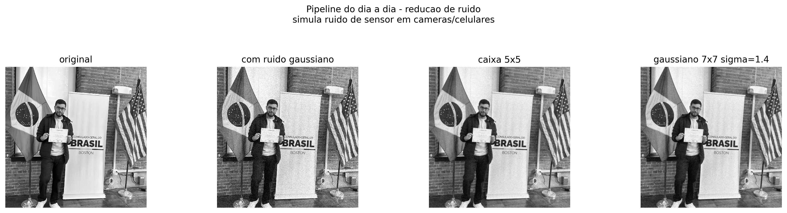

No primeiro pipeline, adicionei ruido gaussiano sintetico para simular ruido de sensor em cameras e celulares. A media e o Gaussiano reduzem o ruido, mas tambem suavizam detalhes. O Gaussiano preservou a aparencia de forma mais natural que a media, porque seus pesos sao mais concentrados no centro.

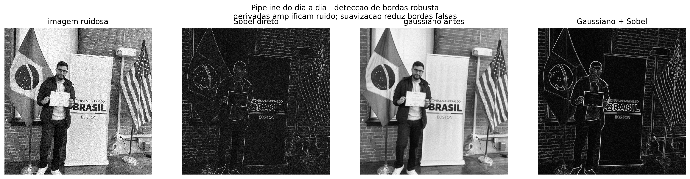

No segundo pipeline, comparei Sobel direto na imagem ruidosa com Gaussiano + Sobel. O Sobel direto detecta muitas variacoes pequenas causadas pelo ruido. Depois da suavizacao, as bordas principais ficam mais limpas. Isso explica por que detectores como Canny usam suavizacao antes da deteccao de bordas.

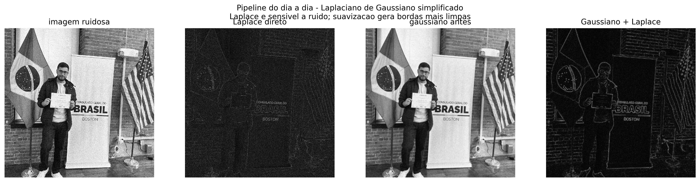

No terceiro pipeline, comparei Laplace direto na imagem ruidosa com Gaussiano + Laplace. O Laplace e muito sensivel a ruido porque usa segunda derivada. Ao suavizar antes, a resposta fica menos contaminada e as bordas estruturais aparecem de forma mais clara.

Esses pipelines aparecem em fotografia digital, cameras de celular, visao computacional e pre-processamento de imagens. Em uma camera, por exemplo, pode haver reducao de ruido antes de nitidez. Em visao computacional, pode haver suavizacao antes de Sobel ou Laplace para evitar bordas falsas.

### 13. Sintese comparativa dos filtros

| Filtro/processo | Tipo principal | Suprime | Realca | Observacao pratica |
| --- | --- | --- | --- | --- |
| Shift | Deslocamento | Nada em magnitude | Nada em magnitude | Preserva magnitude do espectro e muda fase. |
| Caixa/Media | Passa-baixa | Altas frequencias | Baixas frequencias | Simples, mas a resposta tipo sinc pode gerar ringing. |
| Gaussiano | Passa-baixa suave | Altas frequencias | Baixas frequencias | Suavizacao mais natural, sem oscilacoes fortes como a media. |
| Laplace | Passa-alta isotropico | DC e regioes constantes | Bordas e altas frequencias | Muito sensivel a ruido. |
| Sobel | Passa-alta direcional | Regioes suaves | Gradientes/bordas | Estima bordas horizontais e verticais. |
| Nitidez com Laplace | Realce de altas frequencias | Nao remove a base | Detalhes e bordas | Mantem imagem original e amplifica detalhes. |
| Unsharp Mask | Realce por mascara | Nao remove a base | Detalhes da diferenca imagem-blur | Nitidez mais controlavel e comum em fotografia. |
| Emboss | Passa-alta direcional criativo | Regioes uniformes | Bordas direcionais | Simula relevo e iluminacao lateral. |

De forma geral, filtros de suavizacao como media e Gaussiano reduzem ruido e detalhes finos, enquanto filtros derivativos como Laplace e Sobel realcam bordas e tambem podem realcar ruido. Os processos de nitidez ficam entre esses dois mundos: eles preservam a imagem original, mas aumentam a presenca das altas frequencias. Para imagens naturais, o padding `reflect` foi a melhor escolha geral porque evita bordas pretas e reduz artefatos artificiais nas extremidades.

## Parte II - DFT e reconstrucoes parciais

### 1. Objetivo da Parte II

O objetivo da Parte II foi observar uma imagem se formando como soma de senos e cossenos de diferentes frequencias. No dominio espacial eu vejo a imagem como pixels. No dominio da Fourier, eu vejo a imagem como uma combinacao de padroes periodicos: alguns variam devagar, outros variam rapidamente.

As baixas frequencias explicam a estrutura geral da imagem, como regioes grandes, iluminacao e formas suaves. As altas frequencias explicam detalhes finos, bordas, textura e pequenas mudancas de intensidade. Por isso, ao reconstruir uma imagem usando primeiro so as baixas frequencias, ela aparece borrada, mas ja pode ficar reconhecivel. Conforme adicionamos frequencias mais altas, os detalhes voltam.

Os resultados desta parte foram gerados em `outputs/parte2_fourier/`.

### 2. Implementacao manual da DFT

A DFT 2D pode ser escrita conceitualmente como:

```text
F(u, v) = soma_x soma_y f(x, y) * exp(-j * 2*pi * (u*x/M + v*y/N))
```

A transformada inversa tem a ideia oposta:

```text
f(x, y) = (1 / (M*N)) * soma_u soma_v F(u, v) * exp(j * 2*pi * (u*x/M + v*y/N))
```

Na implementacao, eu usei matrizes de DFT. Para uma dimensao, a matriz tem:

```text
W[k, n] = exp(-j * 2*pi*k*n/N)
```

Depois usei a separabilidade da DFT 2D:

```text
F = W_M @ img @ W_N
```

Isso ainda e uma implementacao manual porque eu montei explicitamente a matriz da DFT e fiz a multiplicacao matricial. Eu nao chamei `np.fft.fft2`, `np.fft.ifft2`, `scipy.fft` ou funcoes prontas equivalentes. O NumPy foi usado para operacoes basicas de matriz, exponencial complexa e multiplicacao.

Tambem implementei manualmente o deslocamento do espectro com `fftshift_manual` e `ifftshift_manual`, para centralizar as baixas frequencias sem usar `np.fft.fftshift`.

As imagens foram reduzidas para `64x64` nos experimentos principais. Isso foi necessario porque a DFT manual por matriz tem custo alto: se a imagem cresce muito, as matrizes ficam grandes e as multiplicacoes ficam mais lentas. A validacao numerica foi feita em uma imagem `32x32`, e o erro ficou muito pequeno:

- erro medio: `3.874158481000e-13`
- erro maximo: `1.669775429036e-12`

Isso mostra que `IDFT(DFT(img))` recupera a imagem original praticamente igual, com diferencas apenas de precisao numerica.

### 3. Imagem de alta frequencia

A imagem escolhida para representar alta frequencia foi `quadra-basquete-tdgarden.jpg`. Visualmente, ela tem muitos detalhes pequenos: estrutura da quadra, luzes, linhas, placas, areas com contraste e textura. Mesmo reduzida para `64x64`, ainda da para perceber que existem muitas variacoes locais.

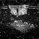

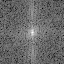

No espectro, a energia nao fica somente concentrada no centro. Ela aparece mais espalhada, porque a imagem depende de varias frequencias para representar os detalhes pequenos. Isso combina com a impressao visual: a imagem tem muita informacao de borda e textura.

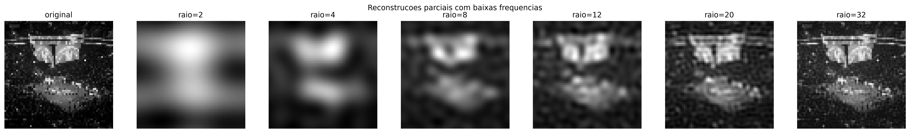

Eu escolhi comentar os raios `8` e `20`.

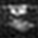

Com raio `8`, a imagem ja mostra a distribuicao geral de claro e escuro, mas ainda fica bem borrada. As formas grandes aparecem, mas detalhes pequenos da quadra e das regioes iluminadas quase desaparecem.


Com raio `20`, a imagem ganha mais contorno e textura. Mesmo assim, ela ainda nao fica completamente nitida. O que chamou minha atencao e que a cena demora mais para recuperar a aparencia original, justamente porque muitos detalhes importantes dependem de frequencias mais altas.

Essa imagem demora mais para ficar nitida porque nao basta manter apenas a estrutura geral. Para recuperar as pequenas variacoes, bordas e texturas, a reconstrucao precisa incluir uma faixa maior do espectro.

### 4. Imagem de baixa frequencia

A imagem escolhida para representar baixa frequencia foi `pessoas-museu-belas-artes-interno.jpg`. Visualmente, ela tem areas mais suaves: paredes, iluminacao gradual e formas maiores. Existem pessoas e contornos, mas a imagem nao depende tanto de textura fina quanto a imagem da quadra.

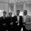

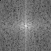

No espectro, a energia fica mais concentrada perto do centro. Isso significa que boa parte da informacao importante esta nas baixas frequencias. Essa observacao bate com a imagem: a estrutura geral e formada por grandes regioes de intensidade e transicoes mais suaves.

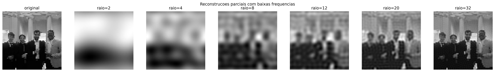

Tambem escolhi os raios `8` e `20` para comentar.

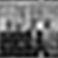

Com raio `8`, a imagem ja fica reconhecivel. Ainda esta borrada, mas eu ja consigo perceber a composicao da cena: a area clara do fundo, a regiao mais escura embaixo e as silhuetas principais.


Com raio `20`, os contornos melhoram bastante e a cena fica bem mais parecida com a original. Ainda falta nitidez fina, mas a maior parte da organizacao visual ja esta presente.

Essa imagem fica reconhecivel rapidamente porque grande parte dela depende de frequencias baixas. As formas grandes e a iluminacao suave aparecem antes dos detalhes pequenos.

### 5. Comparacao final

Comparando as duas imagens, a diferenca principal foi a velocidade com que a reconstrucao ficou compreensivel. Na imagem de baixa frequencia, poucos coeficientes ao redor do centro ja recuperaram a estrutura principal. Na imagem de alta frequencia, os primeiros raios deram apenas uma versao muito borrada, e foi necessario aumentar mais o raio para recuperar detalhes.

Isso se relaciona diretamente com compressao de imagens. Se uma imagem tem muita energia em baixas frequencias, da para guardar uma parte menor do espectro e ainda manter uma versao reconhecivel. Se a imagem tem muitos detalhes finos, bordas, textos, linhas e texturas, descartar altas frequencias causa perda visual mais perceptivel.

Os detalhes finos, bordas e texturas dependem de frequencias altas. Por isso eles somem primeiro quando a reconstrucao usa apenas um raio pequeno no centro do espectro. Ja regioes suaves, ceu, paredes, fundos lisos e iluminacao gradual dependem mais de frequencias baixas. Elas aparecem cedo na reconstrucao.

O experimento deixou claro para mim que a imagem nao e reconstruida "por pedacos espaciais", mas por componentes de frequencia. Primeiro aparecem as variacoes lentas, que dao a estrutura geral. Depois entram frequencias mais altas, que devolvem contornos e nitidez.
